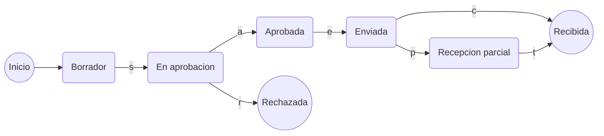

# compra

```mermaid
flowchart LR
 start((Inicio)) --> q0
 q0("Borrador")
 q1("En aprobacion")
 q2("Aprobada")
 q3("Enviada")
 q4("Recepcion parcial")
 q5(("Recibida"))
 q6(("Rechazada"))
 q0 -->|s| q1
 q1 -->|a| q2
 q1 -->|r| q6
 q2 -->|e| q3
 q3 -->|p| q4
 q3 -->|c| q5
 q4 -->|t| q5
```
