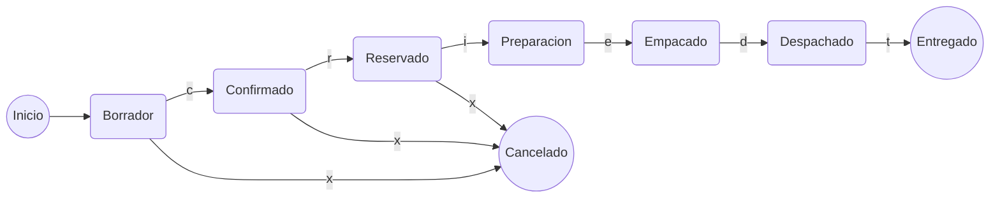

# pedido

```mermaid
flowchart LR
 start((Inicio)) --> q0
 q0("Borrador")
 q1("Confirmado")
 q2("Reservado")
 q3("Preparacion")
 q4("Empacado")
 q5("Despachado")
 q6(("Entregado"))
 q7(("Cancelado"))
 q0 -->|c| q1
 q1 -->|r| q2
 q2 -->|i| q3
 q3 -->|e| q4
 q4 -->|d| q5
 q5 -->|t| q6
 q0 -->|x| q7
 q1 -->|x| q7
 q2 -->|x| q7
```
