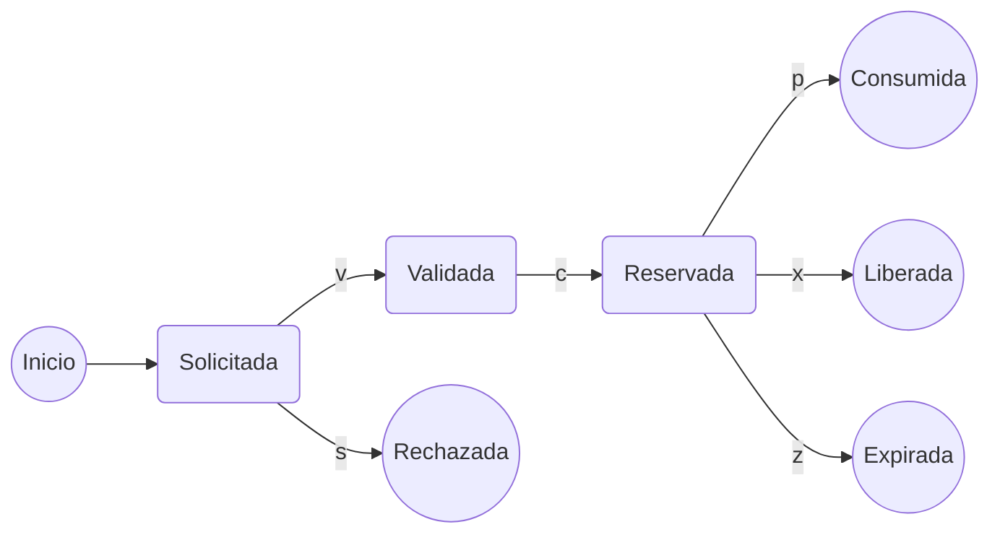

# reserva

```mermaid
flowchart LR
 start((Inicio)) --> q0
 q0("Solicitada")
 q1("Validada")
 q2("Reservada")
 q3(("Consumida"))
 q4(("Liberada"))
 q5(("Expirada"))
 q6(("Rechazada"))
 q0 -->|v| q1
 q0 -->|s| q6
 q1 -->|c| q2
 q2 -->|p| q3
 q2 -->|x| q4
 q2 -->|z| q5
```
